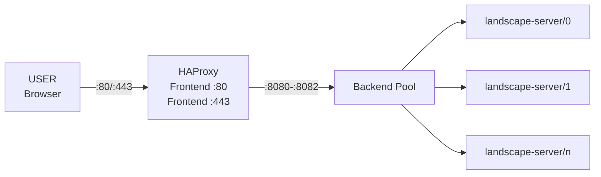

# HAProxy Configuration in Landscape Charm

## Architecture Overview

```
┌─────────┐    :80/:443     ┌─────────────────┐    :8080-:8082    ┌────────────────────┐
│  USER   │ ──────────────▶ │     HAProxy     │ ─────────────────▶ │ landscape-server/0 │
│(Browser)│                 │                 │                    │  :8080, :8081,     │
└─────────┘                 │ Frontend :80    │                    │  :8082, etc.       │
                            │ Frontend :443   │ ─────────────────▶ ├────────────────────┤
                            │                 │                    │ landscape-server/1 │
                            │  (shared        │ ─────────────────▶ │  :8080, :8081,     │
                            │   frontends)    │                    │  :8082, etc.       │
                            └─────────────────┘                    └────────────────────┘
                                    │                                   Backend Pool
                                    │                              (HAProxy load-balances across
                                    └─── Routes to ALL units       all landscape-server units)
```

## Mermaid Version



## HAProxy Configuration Details

### Frontend Configuration
HAProxy exposes these public-facing listeners:
- **HTTP Frontend**: Port 80 for web traffic
- **HTTPS Frontend**: Port 443 for encrypted web traffic  
- **gRPC Frontend**: Port 6554 for Windows Subsystem for Linux (WSL) hostagent communication
- **Ubuntu Installer Frontend**: Port 50051 for Ubuntu installer attach functionality

### Backend Pool Configuration
Each frontend routes to corresponding backend pools that contain multiple landscape-server units:

#### HTTP/HTTPS Backends
- **landscape-http-ping**: Health check endpoints (:8070 + worker_id)
- **landscape-http-message**: Message system endpoints (:8090 + worker_id)  
- **landscape-http-api**: API endpoints (:9080 + worker_id)
- **landscape-http-package-upload**: Package upload (:9100) - leader only
- **landscape-http-hashid-databases**: Hash ID databases (:8080 + worker_id) - leader only

#### Worker Process Distribution
Each landscape-server unit runs multiple worker processes:
```python
# From haproxy.py PORTS configuration
PORTS = {
    "appserver": 8080,      # Main application server
    "pingserver": 8070,     # Health check endpoint  
    "message-server": 8090, # Message handling
    "api": 9080,           # API endpoints
    "package-upload": 9100, # Package upload service
}
```

For `worker_counts = 3`, a single unit will have:
- appserver on ports 8080, 8081, 8082
- pingserver on ports 8070, 8071, 8072
- message-server on ports 8090, 8091, 8092
- api on ports 9080, 9081, 9082

### Routing Logic
HAProxy uses ACL (Access Control List) rules to route requests to appropriate backends:

```
# URL path routing examples:
/ping         → landscape-http-ping backend
/api/*        → landscape-http-api backend  
/message-system/* → landscape-http-message backend
/upload/*     → landscape-http-package-upload backend
/hash-id-databases/* → landscape-http-hashid-databases backend
```

### Load Balancing
- **Algorithm**: `leastconn` (least connections)
- **Health Checks**: `HEAD / HTTP/1.0` with 5-second intervals
- **High Availability**: Traffic automatically routes around failed backend servers
- **SSL Termination**: HTTPS traffic is decrypted at HAProxy and forwarded as HTTP to backend servers